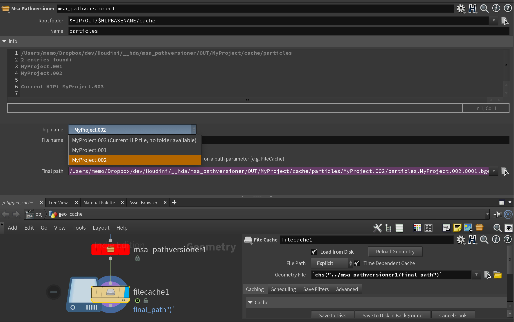

# msa_pathversioner

A tiny OTL to manage versioning with cache.



## Goals
 - Easily view any cache from any version of a HIP. E.g. view the cache generated from `MyProject.001.hip` when working in `MyProject.003.hip`.
 - Given a cache (or its render), quickly retrieve the settings, configuration and network that led to it (i.e. open the HIP in its filename)

## Details

The OTL displays (as a dropdown menu) the available folders which contain a cache, allowing you to select which version of the cache to use.

The default path for caches are constructed as:

`<Root>/<HipBaseName>/cache/<Name>/<CacheHipName>/<Name>.<CacheHipName>.F4.bgeo.sc`

E.g.

`/OUT/MyProject/cache/particles/MyProject.001/particles.MyProject.001.9999.bgeo.sc`

- `<Root>`: user supplied root output directory (e.g. an `OUT` folder on a drive)
- `<HipBaseName>`: `$HIPNAME` without the version number (e.g. `MyProject`)
- `<Name>`: user supplied descriptive name (e.g. `particles` or `fluid` etc.)
- `<CacheHipName>`: user selected HIP filename to use (e.g. `Current HIP File`, `MyProject.001`, `MyProject.002` etc.)

The OTL itself doesn't do any caching or anything else. It is just a UI for constructing a path. The `final path` parameter can be copy-pasted as a reference into the path field of any other node (e.g. FileCache, Render etc).


More info and motivation at https://www.sidefx.com/forum/topic/91845/

## Example Directory Tree

```
    # Houdini source folder
    └── Houdini
        ├── MyProject.001.hiplc
        ├── MyProject.002.hiplc
        └── MyProject.003.hiplc


    # Elsewhere, Output folder
    └── OUT
        └── MyProject
            └── cache
                └── particles
                    ├── MyProject.001
                    │   ├── particles.MyProject.001.0001.bgeo.sc
                    │   ├── particles.MyProject.001.0002.bgeo.sc
                    │   ├── particles.MyProject.001.0003.bgeo.sc
                    └── MyProject.002
                        ├── particles.MyProject.002.0001.bgeo.sc
                        ├── particles.MyProject.002.0002.bgeo.sc
                        ├── particles.MyProject.002.0003.bgeo.sc

```
